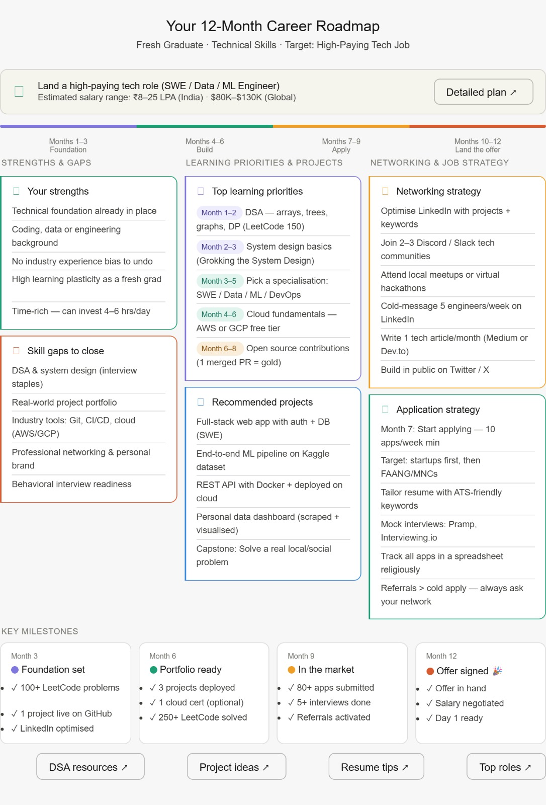

# Day 4 - Chain of Thought Prompting

## Prompt Used
(Claude challenge prompt)

## Answers

### Q1: Current Situation
Student / Fresh Graduate

### Q2: Current Skills
Technical (Coding, Data, Engineering)

### Q3: Target Goal
Land a High-Paying Tech Job

### Q4: Timeline
1 Year (Steady)

## Personalized Roadmap Summary

- Focus on DSA and System Design
- Build real-world projects
- Learn Cloud Fundamentals
- Contribute to Open Source
- Optimize LinkedIn and GitHub
- Start applying from Month 7
- Use networking and referrals

## Biggest Insight

Referrals convert much better than cold applications. Building a network early can significantly improve internship and job opportunities.

## Key Learnings

1. Chain-of-Thought prompting creates structured and personalized outputs.
2. Breaking problems into steps improves AI reasoning.
3. A roadmap becomes more actionable when milestones are clearly defined.
4. Networking is as important as technical skills.

## Screenshot

