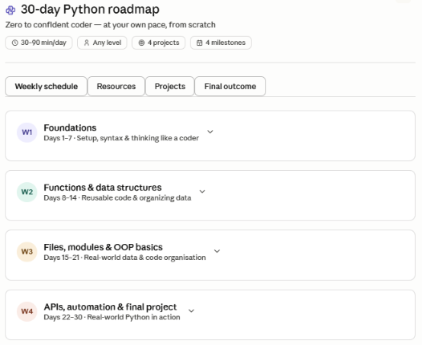
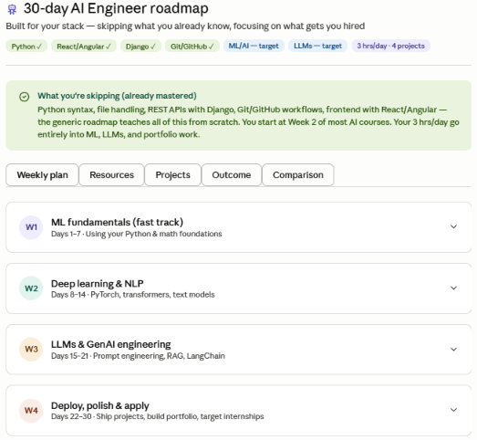

# Day 5 - Context Engineering

## Prompt A (Without Context)

Create a 30-day learning roadmap.

Include:
- Weekly milestones
- Daily tasks
- Resources
- Projects
- Final outcome

Make it practical and beginner-friendly.

### Output Summary
Claude generated a generic 30-day Python roadmap for beginners.

### Screenshot

---

## Prompt B (With Context)

Current Situation: Student

Current Skills:
- Python
- Django
- React
- Git/GitHub

Goal:
Become an AI Engineer

Available Time:
3 Hours Per Day

Experience Level:
Intermediate

Preferred Learning Style:
Projects

### Output Summary
Claude generated a personalized AI Engineer roadmap focused on ML, NLP, LLMs, RAG, LangChain, projects and job preparation.

### Screenshot

---

## Comparison

### 1. Which roadmap feels more personalized?
Prompt B

### 2. Which roadmap would you actually follow?
Prompt B

### 3. What role did context play?
Context helped Claude understand my current skills, goal and learning style, resulting in a focused roadmap instead of a generic one.

---

## Key Learnings

- Context improves AI responses significantly.
- Personalized prompts generate better outputs.
- AI can skip topics already known by the user.
- More details in prompts lead to more useful results.

## Conclusion

Context Engineering helps AI provide tailored and highly relevant responses. Prompt B was far more useful than Prompt A because it considered my background and career goal.
