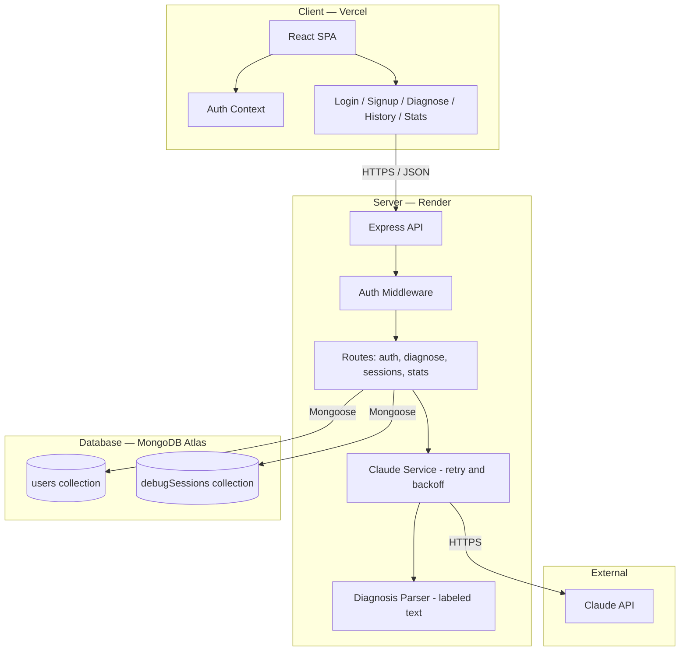
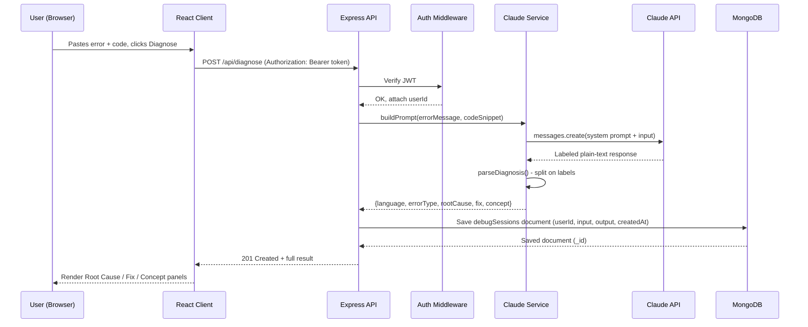
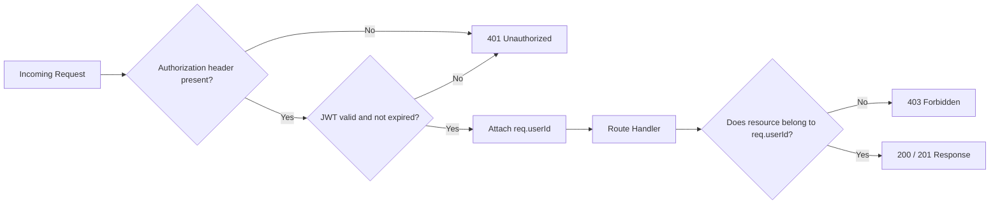

# DebugMate — System Architecture

Status: Finalized Day 2 (Design). Source of truth alongside the PRD and Implementation Blueprint.

---

## 1. Tech Stack (confirmed)

- **Frontend:** React (Vite)
- **Backend:** Node.js + Express
- **Database:** MongoDB Atlas (free M0 cluster) via Mongoose
- **Auth:** JWT (`jsonwebtoken`) + password hashing (`bcryptjs`)
- **AI:** Claude API (Anthropic), called server-side only
- **Hosting:** Vercel (frontend), Render (backend), MongoDB Atlas (database) — all free tier
- **Other:** `cors`, `dotenv`, `react-router-dom`, `axios`, `date-fns`

---

## 2. Component Diagram



**Key principle:** the browser only ever talks to the Express API. It never calls MongoDB or the Claude API directly — both of those only happen server-side. This protects the Claude API key and prevents a client from tampering with saved data.

---

## 3. Data Flow — Diagnosis Request (the core loop)



If the Claude API call fails, `Claude Service` retries up to 2 additional times with exponential backoff before returning a `502`/friendly error to the client (FR-2.4).

---

## 4. Request Lifecycle — Every Protected Request



This lifecycle is identical for `/api/diagnose`, `/api/sessions`, `/api/sessions/:id`, and `/api/stats` — implemented once in `authMiddleware` and reused everywhere (Day 4 builds this once; every later day reuses it).

---

## 5. AI Interaction Design

- **Where it happens:** only inside `server/services/claudeService.js`. The frontend never imports or calls the Claude SDK.
- **Prompt strategy:** a fixed system prompt instructs Claude to always respond in labeled plain text:
  ```
  LANGUAGE: <detected language>
  ERROR_TYPE: <short label>
  ROOT_CAUSE: <2-3 sentences>
  FIX: <code or steps>
  CONCEPT: <plain-English explanation>
  ```
  This avoids JSON parsing of AI output entirely — the backend parses with simple string splitting on these labels, which is far more robust to minor formatting drift than strict JSON.
- **Reliability:** retry with exponential backoff (max 3 attempts total) on transient failures (timeouts, 5xx from Claude). A non-retryable failure (e.g., invalid API key) fails fast with a clear error.
- **Cost/rate-limit safety:** one Claude call per diagnosis request; no streaming, no chained calls — keeps usage predictable per NFR-Performance and the PRD's risk mitigation for API costs.

---

## 6. External Services

| Service | Purpose | Tier |
|---|---|---|
| MongoDB Atlas | Primary database (users, debugSessions) | Free M0 cluster |
| Anthropic Claude API | Diagnosis engine | Free/trial usage per PRD assumption |
| Vercel | Frontend hosting + CI/CD from GitHub | Free (Hobby) tier |
| Render | Backend hosting + CI/CD from GitHub | Free Web Service tier |
| GitHub | Source control, triggers both deploys | Free |

---

## 7. Environment Variables (server)

| Variable | Purpose | Where set |
|---|---|---|
| `MONGODB_URI` | Atlas connection string | Local `.env` (dev) / Render dashboard (prod) |
| `JWT_SECRET` | Signs/verifies auth tokens | Local `.env` (dev) / Render dashboard (prod) |
| `ANTHROPIC_API_KEY` | Claude API access | Local `.env` (dev) / Render dashboard (prod) |
| `PORT` | Express listen port | Set by Render automatically in prod |

None of these are ever committed to git — `.env` stays in `.gitignore`, and only `.env.example` (with placeholder values) is committed.
