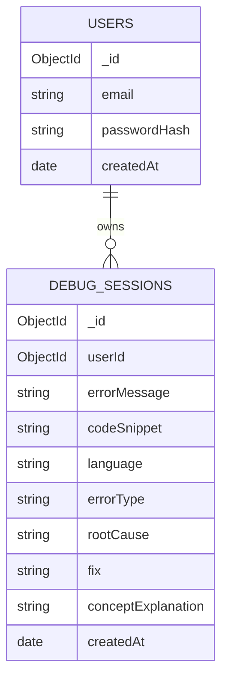

# DebugMate — Database Schema

Database: MongoDB Atlas (free M0 cluster), accessed via Mongoose.
Two collections are sufficient for the entire v1.0 scope — no more, no less.

---

## 1. `users` collection

| Field | Type | Constraints | Notes |
|---|---|---|---|
| `_id` | ObjectId | auto-generated | Primary key |
| `email` | String | required, unique, lowercase, trimmed | Used for login; uniqueness enforced by a MongoDB unique index |
| `passwordHash` | String | required | Bcrypt hash — **never** the plain password |
| `createdAt` | Date | required, default: now | Set once on signup |

**Mongoose sketch:**
```js
const userSchema = new Schema({
  email: { type: String, required: true, unique: true, lowercase: true, trim: true },
  passwordHash: { type: String, required: true },
  createdAt: { type: Date, default: Date.now },
});
```

**Indexes:** unique index on `email` (both enforces FR-1.1's "no duplicate accounts" rule and speeds up login lookups).

---

## 2. `debugSessions` collection

| Field | Type | Constraints | Notes |
|---|---|---|---|
| `_id` | ObjectId | auto-generated | Primary key |
| `userId` | ObjectId | required, ref: `User` | Owner of this session — every query is filtered by this |
| `errorMessage` | String | required | Raw error text pasted by the user |
| `codeSnippet` | String | required | Raw code pasted by the user |
| `language` | String | required | AI-detected (e.g., "Python", "JavaScript") |
| `errorType` | String | required | AI-generated short label (e.g., "IndexError") |
| `rootCause` | String | required | AI explanation of why the error occurred |
| `fix` | String | required | AI-suggested fix |
| `conceptExplanation` | String | required | AI's plain-English concept explanation |
| `createdAt` | Date | required, default: now | Used for sorting history and the stats "over time" view |

**Mongoose sketch:**
```js
const debugSessionSchema = new Schema({
  userId: { type: Schema.Types.ObjectId, ref: "User", required: true, index: true },
  errorMessage: { type: String, required: true },
  codeSnippet: { type: String, required: true },
  language: { type: String, required: true },
  errorType: { type: String, required: true },
  rootCause: { type: String, required: true },
  fix: { type: String, required: true },
  conceptExplanation: { type: String, required: true },
  createdAt: { type: Date, default: Date.now, index: true },
});
```

**Indexes:**
- `userId` — every read in the app (`history`, `stats`) filters by the logged-in user first; this index makes those queries fast even as the collection grows.
- `createdAt` — supports the "newest first" sort on History and the "over time" grouping on Stats.
- A compound index `{ userId: 1, createdAt: -1 }` is the most efficient single index for the History list query specifically, and is the one actually created in Day 6.

---

## 3. Relationship



One user → many debugging sessions. No other relationships exist in v1.0 (no teams, no shared sessions, no tags-as-separate-collection — `errorType` and `language` are simple string fields, not references, since v1.0 explicitly excludes advanced tagging/search per the PRD).

---

## 4. Schema Validation Against Every User Story

| User Story (PRD Section 8) | Satisfied by |
|---|---|
| "As a new user, I want to sign up quickly" | `users.email` + `users.passwordHash`, unique index prevents duplicate accounts |
| "As a developer stuck on an error, I want to paste it and my code and get a clear explanation" | `debugSessions.errorMessage`, `codeSnippet`, `rootCause`, `fix` |
| "As a learner, I want each fix explained conceptually" | `debugSessions.conceptExplanation` |
| "As a returning user, I want to see my past debugging sessions" | `debugSessions` filtered by `userId`, sorted by `createdAt` |
| "As a motivated learner, I want to see stats about my most common mistakes" | Aggregation over `debugSessions.errorType`, `.language`, `.createdAt`, scoped by `userId` |
| "As a mobile user, I want the tool to work well on my phone" | Not a data concern — handled entirely in UI (Section 5) |

Every functional requirement in PRD Section 6 maps to a field above — no field exists without a requirement driving it, and no requirement lacks a field. This is a deliberately minimal schema: two collections, no premature normalization.

---

## 5. Explicit Non-Requirements (why the schema stays this small)

- No `tags` collection — language/errorType are plain strings (Future Scope: custom tags).
- No `sessions` (auth session) collection — JWT is stateless, nothing to store server-side for login sessions.
- No `teams`/`workspaces` collection — out of scope per PRD 5.2.
- No soft-delete or archival fields — v1.0 has no delete feature at all.
