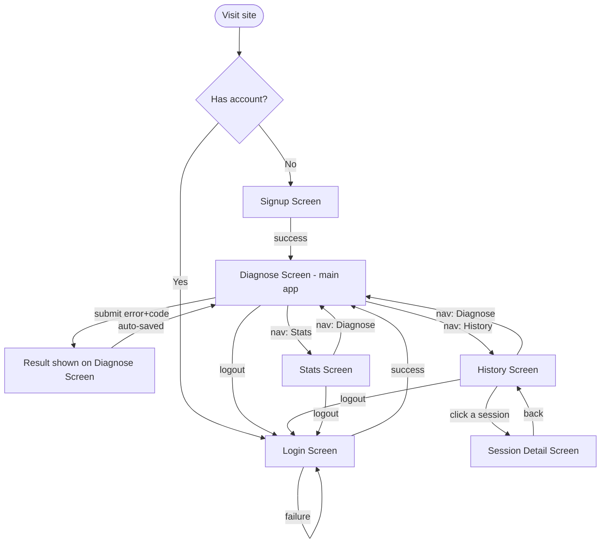
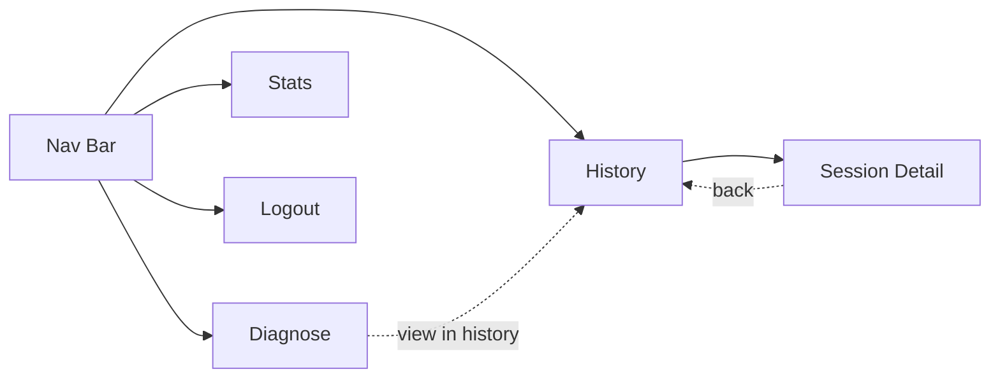

# DebugMate — UI & User Flow

Six screens total. Every screen exists to satisfy a specific user story or requirement from the PRD — nothing extra.

---

## 1. User Flow Diagram



---

## 2. Screen Inventory (why each screen exists)

| Screen | Satisfies |
|---|---|
| Login | FR-1.2, FR-1.5 |
| Signup | FR-1.1 |
| Diagnose (home) | FR-2.1–2.5 — the core loop |
| History | FR-3.2, FR-3.4 |
| Session Detail | FR-3.3 |
| Stats Dashboard | FR-4.1–4.4 |

Shared across all logged-in screens: a **Nav Bar** (Diagnose / History / Stats / Logout) — satisfies the "feels like one cohesive app" polish goal from Day 7.

---

## 3. Low-Fidelity Wireframes

### 3.1 Login
```
┌─────────────────────────────────────┐
│  DebugMate                          │
│                                       │
│   Welcome back                       │
│   ┌─────────────────────────────┐   │
│   │ Email                        │   │
│   └─────────────────────────────┘   │
│   ┌─────────────────────────────┐   │
│   │ Password                     │   │
│   └─────────────────────────────┘   │
│   [ Log In ]                         │
│                                       │
│   New here? Create an account →      │
└─────────────────────────────────────┘
```

### 3.2 Signup
```
┌─────────────────────────────────────┐
│  DebugMate                          │
│                                       │
│   Create your account                │
│   ┌─────────────────────────────┐   │
│   │ Email                        │   │
│   └─────────────────────────────┘   │
│   ┌─────────────────────────────┐   │
│   │ Password (min 8 characters)  │   │
│   └─────────────────────────────┘   │
│   [ Sign Up ]                        │
│                                       │
│   Already have an account? Log in →  │
└─────────────────────────────────────┘
```

### 3.3 Diagnose (home / core loop)
```
┌───────────────────────────────────────────────────┐
│ DebugMate     [Diagnose] [History] [Stats] [Logout]│
├───────────────────────────────────────────────────┤
│  Paste your error                                   │
│  ┌─────────────────────────────────────────────┐   │
│  │ IndexError: list index out of range          │   │
│  └─────────────────────────────────────────────┘   │
│  Paste your code                                     │
│  ┌─────────────────────────────────────────────┐   │
│  │ print(items[5])                               │   │
│  │                                                │   │
│  └─────────────────────────────────────────────┘   │
│  [ Diagnose ]                                        │
│                                                       │
│  ── Result ──────────────────────────────────────    │
│  Python · IndexError                                 │
│  ┌─── Root Cause ───┐ ┌──── Fix ────┐ ┌─ Concept ─┐  │
│  │ ...                │ │ ...          │ │ ...        │
│  └────────────────────┘ └──────────────┘ └────────────┘
└───────────────────────────────────────────────────┘
```
Loading state: the three result cards are replaced with a single "Diagnosing your error..." message + spinner while waiting.
Error state: a red inline banner above the form: "Something went wrong — please try again."

### 3.4 History (list)
```
┌───────────────────────────────────────────────────┐
│ DebugMate     [Diagnose] [History] [Stats] [Logout]│
├───────────────────────────────────────────────────┤
│  Your debugging history                              │
│                                                       │
│  ┌─────────────────────────────────────────────┐   │
│  │ Python · IndexError          2 hours ago  →   │   │
│  ├─────────────────────────────────────────────┤   │
│  │ JavaScript · TypeError        1 day ago   →   │   │
│  ├─────────────────────────────────────────────┤   │
│  │ Python · SyntaxError          3 days ago  →   │   │
│  └─────────────────────────────────────────────┘   │
└───────────────────────────────────────────────────┘
```
Empty state (0 sessions):
```
│         You haven't debugged anything yet.           │
│         [ Diagnose your first error → ]               │
```

### 3.5 Session Detail
```
┌───────────────────────────────────────────────────┐
│ DebugMate     [Diagnose] [History] [Stats] [Logout]│
├───────────────────────────────────────────────────┤
│  ← Back to History                                   │
│  Python · IndexError · Jul 22, 2026                  │
│                                                       │
│  Your input:                                          │
│  ┌───────────────────┐ ┌───────────────────────┐    │
│  │ Error message      │ │ Code snippet            │    │
│  └───────────────────┘ └───────────────────────┘    │
│                                                       │
│  ┌─── Root Cause ───┐ ┌──── Fix ────┐ ┌─ Concept ─┐  │
│  │ ...                │ │ ...          │ │ ...        │
│  └────────────────────┘ └──────────────┘ └────────────┘
└───────────────────────────────────────────────────┘
```

### 3.6 Stats Dashboard
```
┌───────────────────────────────────────────────────┐
│ DebugMate     [Diagnose] [History] [Stats] [Logout]│
├───────────────────────────────────────────────────┤
│  Your debugging stats                                 │
│                                                       │
│  Error types              Languages                  │
│  IndexError    ████ 4     Python      ██████ 6       │
│  TypeError     ██ 2       JavaScript  ██ 2            │
│  SyntaxError   █ 1                                     │
│                                                       │
│  Sessions over time                                    │
│  ▂▃▁▅▂▇▃  (last 7 days)                                │
└───────────────────────────────────────────────────┘
```
Partial/empty state (0-1 sessions):
```
│   Not enough data yet — diagnose a few more errors    │
│   to see your patterns.                                │
```

---

## 4. Navigation Map



- The Nav Bar is present on all three logged-in screens (Diagnose, History, Stats) — never on Login/Signup.
- Session Detail is reached only from History (no direct URL entry point in the UI, though the route itself is protected server-side regardless).
- After a successful diagnosis, a "View in history" link appears in the result panel, closing the loop between Diagnose and History (per Day 6 of the Blueprint).

---

## 5. Responsive Behavior (mobile ~375px)

- Diagnose: the two textareas (error, code) and the three result cards stack vertically instead of side-by-side.
- History: list items remain full-width single-column (already mobile-friendly by default).
- Stats: the two-column error/language breakdown stacks into a single column; the "sessions over time" bar strip scales down but stays legible.
- Nav Bar: collapses to icon-only or a simple horizontal scroll row on narrow screens — never a hidden hamburger menu, since there are only 4 items and this is a small app.
