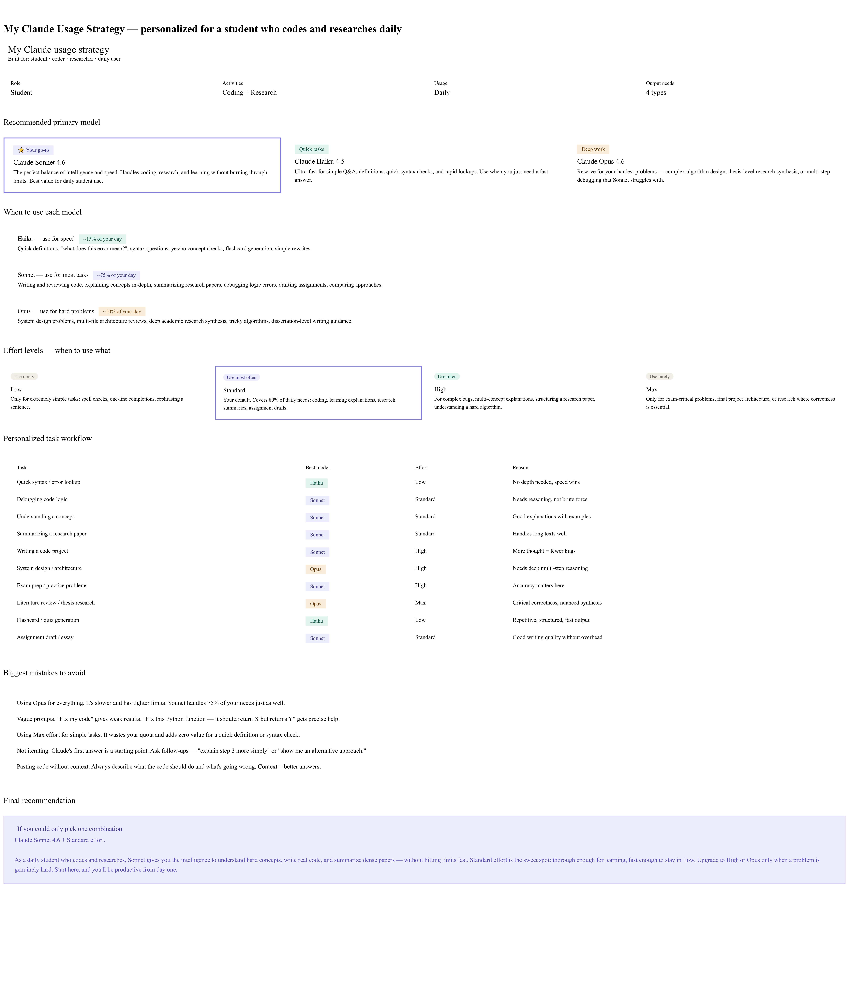

# Day 7 - Claude Usage Strategy

## Objective

Learn how to use different Claude models and effort levels effectively for coding, learning, research, and career development.

---

## My Profile

**Current Situation:** Student

### Primary Activities

* Coding
* Learning
* Career Preparation
* Resume Building
* Research
* AI Tools Practice

### Claude Usage

* Daily

### Required Outputs

* Coding Help
* Learning Support
* Deep Research
* Career Guidance

---

## Personalized Claude Strategy

### Recommended Primary Model

**Claude Sonnet**

### Why This Model Fits Me

Claude Sonnet provides the best balance between speed, reasoning, coding assistance, learning support, and research capabilities. It is ideal for students who use AI regularly for academics, projects, and career preparation.

---

## When to Use Haiku

* Quick questions
* Simple explanations
* Fast summaries
* Basic productivity tasks
* Brainstorming ideas

## When to Use Sonnet

* Coding projects
* Learning new concepts
* Resume optimization
* GitHub documentation
* Daily AI challenge tasks
* Assignment support

## When to Use Opus

* Deep research
* Complex project planning
* Long-form analysis
* Advanced reasoning tasks
* Strategic career planning

---

## Recommended Effort Levels

### Low

* Quick answers
* Simple queries
* Fast information retrieval

### Standard

* Daily learning
* Coding tasks
* Productivity workflows
* General problem solving

### High

* Project planning
* Resume reviews
* Detailed explanations
* Debugging complex issues

### Max

* Complex research
* Strategy building
* Advanced problem solving
* Critical decision-making tasks

---

## Personalized Workflow

| Task            | Best Model | Best Effort | Reason                              |
| --------------- | ---------- | ----------- | ----------------------------------- |
| Coding          | Sonnet     | Standard    | Best coding support and debugging   |
| Learning        | Sonnet     | Standard    | Clear and detailed explanations     |
| Research        | Opus       | High        | Deep analysis and reasoning         |
| Quick Questions | Haiku      | Low         | Fast responses                      |
| Resume Review   | Sonnet     | High        | Better optimization and suggestions |
| Career Planning | Opus       | High        | Strategic guidance and planning     |

---

## Biggest Mistakes To Avoid

1. Using High effort for simple questions.
2. Using Haiku for complex research tasks.
3. Ignoring the strengths of different models.
4. Asking vague or unclear prompts.
5. Not providing sufficient context.
6. Using Max effort unnecessarily.

---

## Key Learnings

* Different Claude models are optimized for different tasks.
* Claude Sonnet is the best all-round model for students.
* Effort settings directly affect output quality and depth.
* Providing context significantly improves AI responses.
* Choosing the right model saves time and improves productivity.

---

## Final Recommendation

If I could use only one model and one effort level for most of my work, I would choose:

**Model:** Claude Sonnet
**Effort Level:** Standard

### Reason

This combination provides the best balance of speed, accuracy, reasoning, coding support, learning assistance, and overall productivity for a Computer Science student.

---

## Screenshots

### Claude Usage Strategy Output

---

**Conclusion:**
Day 7 helped me understand how to use Claude more effectively by selecting the right model and effort level based on the task. This knowledge will help me improve productivity, learning efficiency, and AI-assisted problem-solving.
